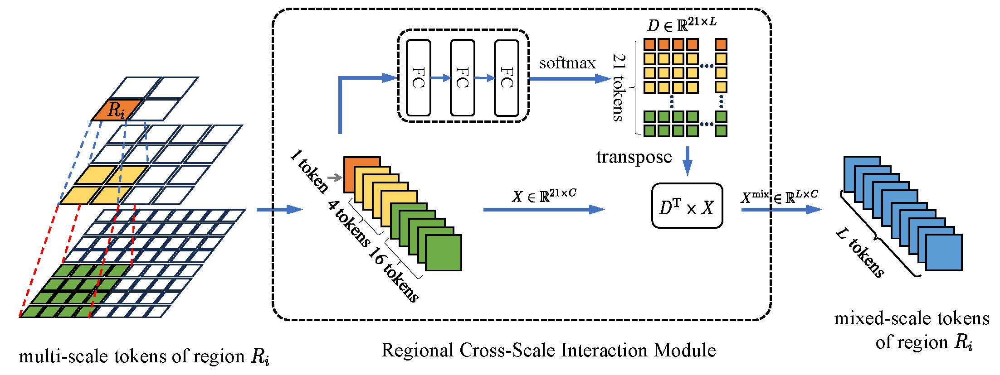

## Data-Efficient Multi-Scale Fusion Vision Transformer


### 1. Abstract

Vision transformer (ViT) demonstrates significant potential in image classification when handling extensive data. 
However, the vanilla ViT struggles with small datasets when trained from scratch. 
To address this issue, this paper proposes generating multi-scale embeddings for supplementing data deficiencies of small datasets.
Our model generates tokens of varying scales from images using different patch sizes, 
where each token of the larger scale is linked to a set of tokens of other smaller scales based on spatial location. 
Through a regional cross-scale interaction module, tokens of different scales interact regionally to enhance the learning of local structures. 
Additionally, we implement a data augmentation schedule to refine training.
Extensive experiments in image classification demonstrate our approach surpasses DeiT and multi-scale transformers on small datasets. 

<div align="center">
  
</div>

<div align="center">
  
</div>

### 2. Requirements

To install requirements:

```setup
conda create -n dems python=3.8
pip install -r requirements.txt
```

### 3. Datasets

The root paths of data are set to `/path/to/dataset`. Please set the root paths accordingly.
`CIFAR10`, `CIFAR100`, `FashionMNIST`, `EMNIST` datasets provided by `torchvision`. 
Download and extract Caltech101 train and val images from https://www.vision.caltech.edu/datasets/.
The directory structure is the standard layout for the torchvision [`datasets.ImageFolder`](https://pytorch.org/docs/stable/torchvision/datasets.html#imagefolder), and the training and validation data is expected to be in the `train/` folder and `val/` folder respectively.

### 4. Training

Set hyperparameters and GPU IDs in `./config/pretrain/dems_small_pretrain.py`.
Run the following command to train DEMS-ViT-S on CIFAR100 for 800 epochs, with random initialization on a single node with multiple gpus:

```shell script

python main_pretrain --model dems_small --batch_size 256 --epochs 800 --dataset CIFAR100 --data_path /path/to/CIFAR100
```

### 5. Fine-tuning

Set hyperparameters and GPU IDs in `./config/pretrain/dems_small_finetune.py`.
Run the following command to finetune DEMS-ViT-S on CIFAR100 for 100 epochs:

```shell script

python main_finetune --model dems_small --batch_size 256 --epochs 100 --dataset CIFAR100 --data_path /path/to/CIFAR100 --pretrained_weight /path/pretrained
```

### 6. Main Results and Model Weights

#### 6.1 Pretrained weights

We provide models trained on CIFAR, EMNIST, FASHIONNIST, and CALTECH101.
Particularly, we train on CALTECH101 with the input size of 256x256 and patch size of 16.

| Name | #FLOPs | #Params | Dataset | Acc@1 | URL |
| --- | --- | --- | --- | --- | --- |
| DEMS-ViT-Ti | 1.6 | 5.6M |CIFAR10<br>CIFAR100<br>FASHIONMNIST<br>EMNIST<br>CALTECH101 | 96.03<br>80.60<br>95.59<br>99.56<br>86.56 | [model]()<br>[model]()<br>[model]()<br>[model]()<br>[model]() |
| DEMS-ViT-S | 5.8 | 22.3M |  CIFAR10<br>CIFAR100<br>FASHIONMNIST<br>EMNIST<br>CALTECH101 | 96.20<br>83.30<br>95.99<br>99.58<br>86.88 | [model]()<br>[model]()<br>[model]()<br>[model]()<br>[model]() |

#### 6.2 Fine-tuned weights

We provide fine-tuned models on CIFAR, which can be found [here]().

| Name | Dataset | Acc@1 | URL |
| --- | --- | --- | --- |
| DEMS-ViT-Ti | CIFAR10<br>CIFAR100 | 96.74<br>83.50 | [model]()<br>[model]()|
| DEMS-ViT-S | CIFAR10<br>CIFAR100 | 97.76<br>85.16 | [model]()<br>[model]() |

### 7. License

Please refer to [License](./LICENSE.md)
